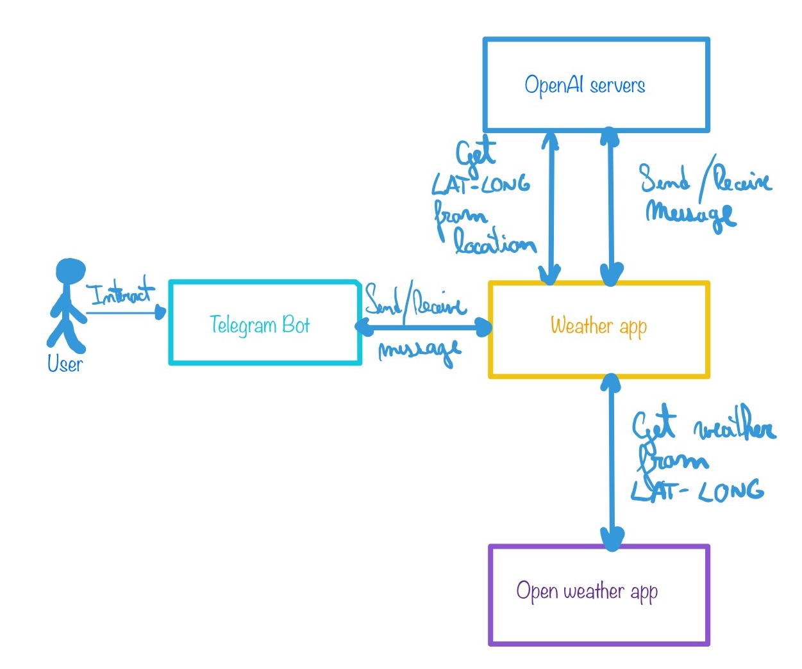

# Weather Chatbot using OpenAI API
Read the full explanation in my blog: www.gersaljo.com

Have you tried to ask OpenAI about the current weather in your city? It answers something like: "It's impossible for me to give you real time information". Here I'm going to show you how you can consume other API's and integrate this answer to build custom chatbots. 

Weather chatbot is a simple example usecase of how we can use the OpenAI API to create a telegram chatbot to give you the current weather in any location worldwide. It additionally uses the Open Weather Map API to obtain real time information. 

# 

Here is a very basic diagram about how this app works: 



1. The user sends a message to the telegram bot, this message is then sent to OpenAI using the `gpt-3.5-turbo` model for creating a conversational agent. 
1. The model was previosly instructed to obtain a location (city, country) from the user and optionally the units used to get the weather such as celcius, fareingheit. Once the users provides this information the OpenAI service send us an alert with this information. 
1. Since Open Weather Map needs latitude and longitude coordinates to return the weather we need to get the latitud and longitud of the given location. Luckily enough we can use OpenAI it self to get this information using another prompt to translate location to lat-long coordinates and return them in json format directly.
1. Once we have the coordinates we can send a GET request to the Open Weather Map API with the lat-long-units information to receive the weather that is then added to the conversation context. 

# Prompts used
## Weather App Agent
This is the system prompt used that helps OpenAI to keep chatting until it gets all the information it needs to execute a function:

```
You are an assistant that gives the current weather anywhere in the world based on city and country. If the user asks you another question about another topic, you have to answer that you are only an assistant who gives the current weather and nothing more. Don't ask what city you are in, rather ask what city you would like to know the weather for. Don't make assumptions about what values to insert into functions. Please request clarification if a user's request is ambiguous regarding the city and country provided. Do not invent climate values.
```

## Location to Lat-Long Agent
This is the prompt used to get the latitude and longitude coordinates given a location:

```
You are going to receive an address and your function is return the earth coordinates of this address: the latitude and longitude of said city/country in JSON format. For example, if you receive: Cochabamba, Bolivia you should return:

{
"latitude": -17.3895,
"longitude": -66.1568
}

Do not add any extra information. In case you don't know these coordinates, you can return a JSON like this:

{
"latitude": 0,
"longitude": 0
}
```

# Other usecases
In this project we demonstrate how to execute local functions using OpenAI tools operator and this can trigger different events in our system such as an API call, function execution, SQL request, Store Procedure execution, a search, etc. This functionality in OpenAI is key to use common human language to do complex tasks and thus extend our system funcionality. 


# Install
- You can get an Open Weather Map API key <a href="https://home.openweathermap.org/">here</a>.
- You can get an OpenAI API key <a href="https://openai.com/">here</a>
- You can get a Telegram token <a href="https://core.telegram.org/api/obtaining_api_id">here</a>


You need to get an OpenAI API Key, an Open Weather Map API Key, a Telegram API Key(optionally), and have them set up as environment variables such as (for MacOs you can add them into your `~/.bash_profile` or `~/.zshrc` files and source them):

```bash
#~/.bash_profile file:

# openai key
export OPENAI_API_KEY='sk-SmKIcS...'

# openweathermap
export OPEN_WEATHER_KEY='a432c...'

# telegram api
export TELEGRAM_API_KEY='677...:AAEM...'
```

adn then source it:

```bash
source ~/.bash_profile
```

Create a virtual python environment, activate it, install the needed libraries from the `requirements.txt` file and finally, execute the main script.

This project assumes you have installed pyenv to handle different python versions and you have activated it the version 3.11.6. These are the commands for MacOS:

```bash
$python --version # 3.11.6
$cd assistant
$python -m venv chatbot-env
$source chatbot-env/bin/activate # activate it
$pip install -r requirements.txt
```

Execute the command line version with:

```bash
$python main.py
```

Execute the telegram bot with:
```bash
$python main_telegram.py
```